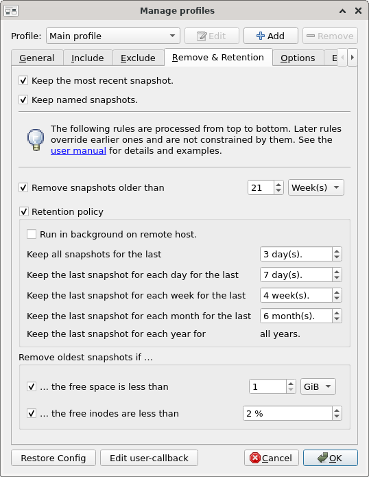
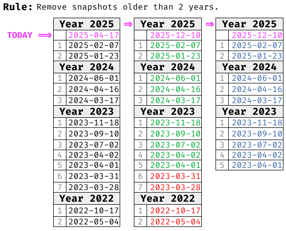
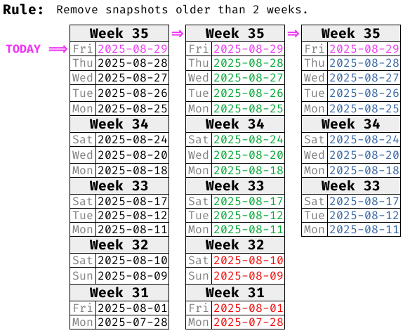
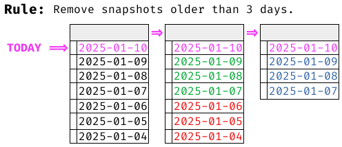
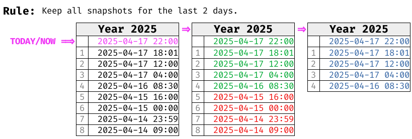
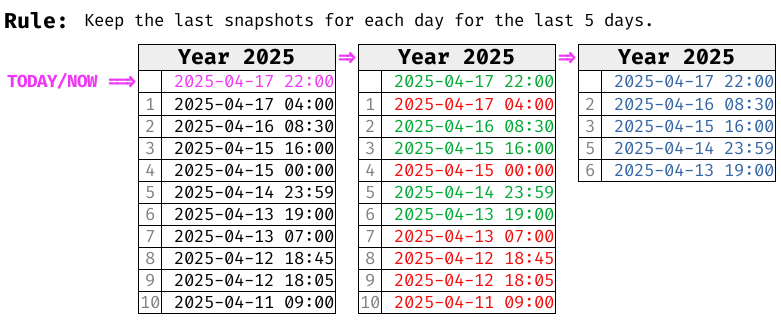
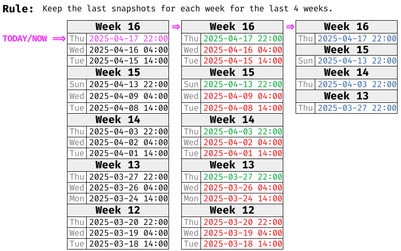
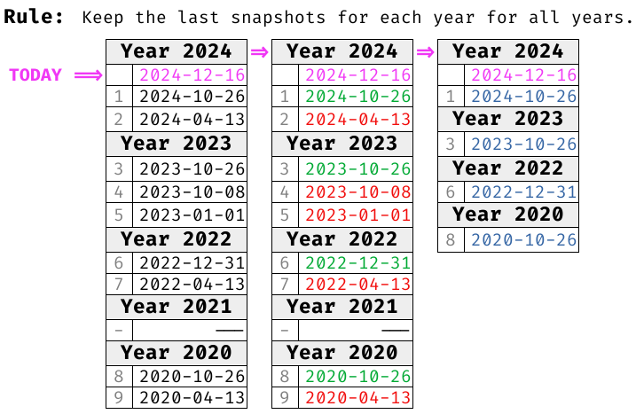

# Remove & Retention
<!--
SPDX-FileCopyrightText: © 2025 Christian Buhtz <c.buhtz@posteo.jp>

SPDX-License-Identifier: GPL-2.0-or-later

This file is part of the program "Back In Time" which is released under GNU
General Public License v2 (GPLv2). See LICENSES directory or go to
<https://spdx.org/licenses/GPL-2.0-or-later.html>
-->
## Overview
Snapshots can be automatically deleted or retained based on rules.
These rules allow for fine-grained management of the backup archive,
reducing storage space usage. The process runs at the end of every snapshot
run, if no new snapshot is created.

!!! note
    The feature was also known as _Auto-remove_ or _Smart Remove_ in earlier
    versions of _Back In Time_ (prior to 1.6.0).

Here is a brief overview of the rules available:

      
- **Keep the most recent snapshot**: The last (or freshest) snapshot will be retained.
- **Keep named snapshots**: All snapshots with a name are excluded from every
  rule and never removed. This is the only one rule that can not be overruled
  by other rules.
- **Remove snapshots older than `N` Days/Weeks/Years**: Snapshots older than
  the specified time period are removed immediately.
- **Retention policy**: A batterie of rules about which snapshots to keep. The
  rest will be removed immediately.
    - **Keep all snapshots for the last `N` days**
    - **Keep the last snapshot for each day/week/month for the last `N` days/weeks/months**
    - **Keep the last snapshot for each year for all years**
- **Remove oldest snapshot if the free space is less than `N` GiB/MiB**: If the
  threshold of free storage space is reached, the oldest snapshots will be
  removed until enough storage space is available again.
- **Remove oldest snapshot if the free inodes are less than `N` %**: If the
  threshold of free inodes is reached, the oldest snapshots will be
  removed until enough inodes are available again.

!!! warning
    All rules are processed from top to bottom, as presented in the GUI or in
    this manual. Later rules **do override** earlier ones and are **not
    constrained** by them. The only exception is the first rule
    *Keep named snapshots*.

## Rules in details
### Keep the most recent snapshot
The most recently created snapshot, in other words the freshest one, will be
retained and not deleted by any of the configured rules. Despite it is present
in the graphical frontend, that behavior cannot be changed.

### Keep named snapshots
Beside the timestamp regularly used to identify snapshots, it is possible to
attach a name to it. Those named snapshots are never touched by any other
rule. It is a guarantee that they won't be removed. See
[Main Window](main-window.md) for more details about named snapshots.

### Remove snapshots older than …

**Remove snapshots older than `N` Years**

- Calculation is based on 12 months.
- Current months is ignored.
- _Example_: Older than two years, at date 2025-04-17, result in
  removing backups before (or older than) 2023-04-01.

**Remove snapshots older than `N` Weeks**

- Calculation is based on calendar weeks with Monday as first day of a week.
- Current week is ignored.
- _Example_: Older than two weeks, at Friday 2025-08-29, result in removing
  backups before (or older than) Monday 2025-08-11.

**Remove snapshots older than `N` Days**

- Calculation is based on full days from 0:00 to 23:59.
- Current day is ignored.
- _Example_: Older than 3 days, at date 2025-01-10, result in removing backups
  before (or older than) 2025-01-07.

### Retention policy
Snapshots are retained if they fit at least one of the the rules from the
retention policy. All other snapshots, not covered by the retention policy,
will be removed.

The values specified are treated as a period rather than a count. For example,
imagine keeping the last snapshot of each month for the past six months,
including the current running months. However, only four of these six months
have snapshots. In this case, only four snapshots are retained. The period is
not extended further into the past to reach a total of six snapshots. See the
rules below for more illustrated examples.

**Keep all snapshots for the last `N` days**

- Calculation is based on full days from 0:00 to 23:59.
- Current day is considered.

_Example_:

**Keep the last snapshot for each day for the last `N` days**

- Calculation is based on full days from 0:00 to 23:59.
- Current day is considered.

_Example_:

**Keep the last snapshot for each week for the last `N` weeks**

- Calculation is based on full calendar weeks starting from Monday.
- Current week is considered.

_Example_:

**Keep the last snapshot for each month for the last `N` months**

- Calculation is based on full calendar months.
- Current months is considered.

_Example_:

**Keep the last snapshot for each year for all years**

- Calculation is based on calendar years.
- Current year is considered.
- Despite it is present in the graphical frontend, that behavior cannot be
  changed, if _Retention Policy_ is enabled.

_Example_:

### Run in background mode on remote host
The remove command can be executed on the local machine or on a remote host via
SSH. The latter can save time and resources.

## Interactions between and mutual constraints of the rules
All rules are applied and executed immediatily one by one and in the order as
presented in the GUI and here in the manual. This contain the potential of
confusing interactions between the rules.

### Example: Three years and all years.
Imagine this two rules:

1. Remove snapshots older than 3 years.
2. Keep last snapshot for each year for all years.

We continue to assume that multiple backups per year have been available over
the past five years.

Rule 2 in isolation would result in five retained backups, one for each of the
five existing years. But rule 1 will be executed beforehand. Rule 1 will remove
all snapshots from four and five years ago.
    
### Example: Six months but less storage space
Imagine this two rules:

1. Keep last snapshot for each months for 6 months.
2. Remove oldest snapshots if the free space is less than 100 GiB.

The consequence of rule 1 is that six snapshots are kept, one for each
months. Additionally imagine some more snapshots because of the other keep rules
beforehand. This consumes so much storage space that there is only 80 GiB free
space left. This is less than the 100 GiB limit configured in rule 2. Because
of that the two oldest snapshots (of months five and six) will be
removed. After this 105 GiB storage space is available again and the rule
stops. The final consequence is that snapshots of four months are kept, instead
of six months as configured in rule 1.

